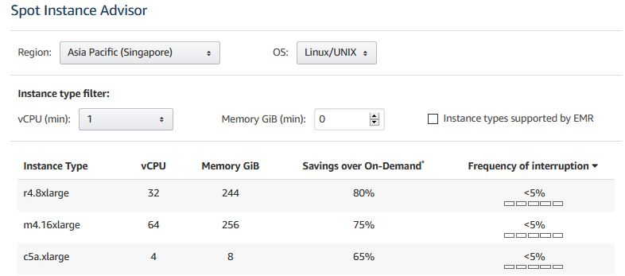

---
title: "Undestanding Spot Instances"
date:  2020-06-13T05:37:54+08:00
weight: 3

---

### What are Spot Instances?

A Spot Instance is an unused EC2 instance that is available for less than the On-Demand price, with up to 90% discount.
Amazon EC2 Spot service can interrupt an individual Spot Instance with two-minutes notice if capacity is no longer available, the Spot price exceeds your maximum price, or demand for Spot Instances increases. 

### If it does get interrupted sometimes, should I still use Spot Instance?
Many [customers](https://aws.amazon.com/ec2/spot/testimonials/) use Spot Instances. 
Check this [Spot Instance Advisor](https://aws.amazon.com/ec2/spot/instance-advisor/) to see the frequency of interruption for certain instance type in an AWS region. 
At the time when this article is written, the average frequency of interruption across all Regions and instance types is <5%. 

### Some best practices around Spot Instances

Your instance type requirements, budget requirements, and application design will determine how to apply the following best practices for your application:

1. **Be flexible about instance types**. Test your application on different instance types when possible. Because prices fluctuate independently for each instance type in an Availability Zone, you can often get more compute capacity for the same price when you have instance type flexibility. Request all instance types that meet your requirements to further reduce costs and improve application performance. Spot Fleets enable you to request multiple instance types simultaneously.
1. **Choose pools where prices haven't changed much**. Because prices adjust based on long-term demand, popular instance types (such as recently launched instance families), tend to have more price adjustments. Therefore, picking older-generation instance types that are less popular tends to result in lower costs and fewer interruptions. Similarly, the same instance type can have different prices in different Availability Zones.
1. **Minimize the impact of interruptions**. Amazon EC2 Spot's Hibernate feature allows you to pause and then resume Amazon EBS backed instances when capacity is available. Hibernate is just like closing and opening your laptop lid, with your application starting up right where it left off. For more information, see Hibernate Your Instance.



### Services that work with spot instances
Spot instance is integrated with [these services](https://docs.aws.amazon.com/whitepapers/latest/cost-optimization-leveraging-ec2-spot-instances/spot-integration-with-other-aws-services.html). You can also [run machine learning training with Spot Instance](https://docs.aws.amazon.com/sagemaker/latest/dg/model-managed-spot-training.html) on Amazon SageMaker and [use Spot Instance with EKS](https://aws.amazon.com/blogs/compute/cost-optimization-and-resilience-eks-with-spot-instances/) for Kubernetes.